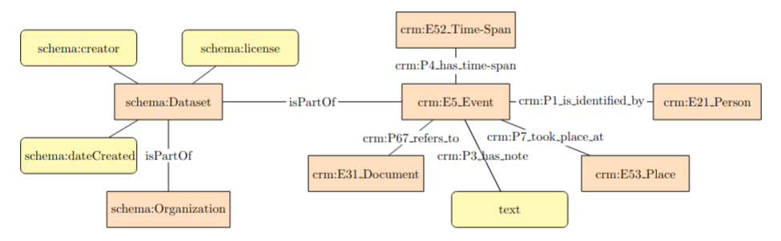

## Canfranc y la Segunda Guerra Mundial

Este proyecto tiene como objetivo representar el conocimiento sobre Canfranc y la Segunda Guerra Mundial con ontologías y estándares internacionales.

### Autores

### Modelado de datos

### Licencia
 Content is licensed under a <a rel="license" href="http://creativecommons.org/licenses/by/4.0/">Creative Commons Attribution 4.0 International license</a>.
